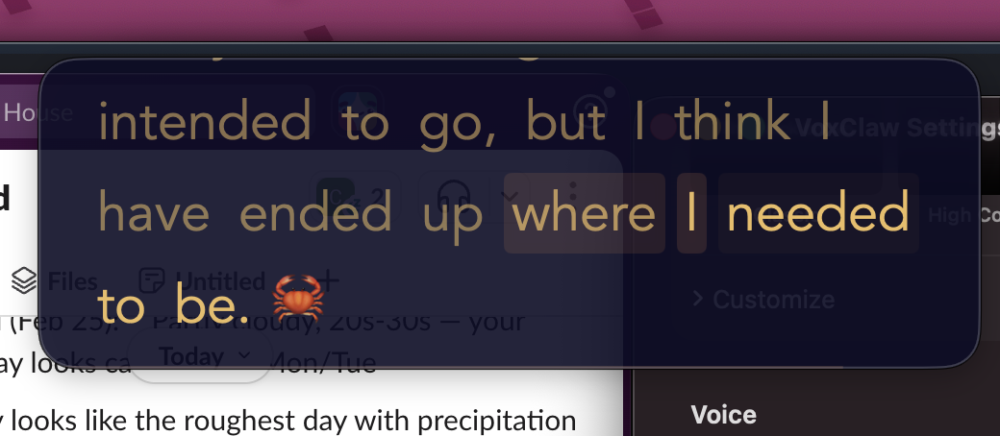
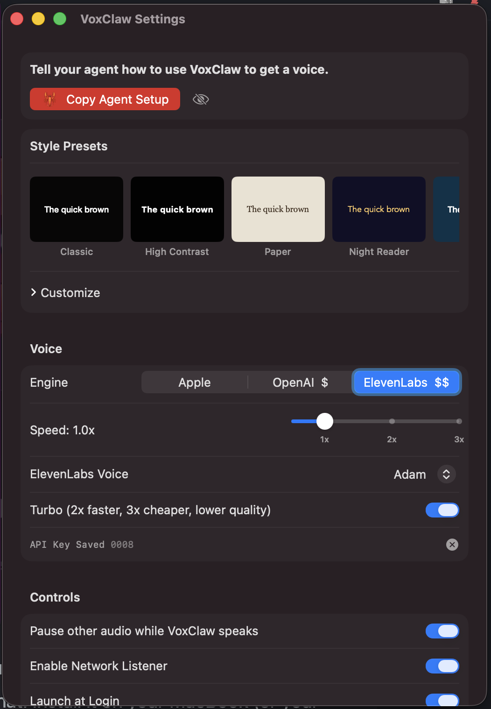

# VoxClaw

<p align="center">
  <a href="https://voxclaw.com/">
    
  </a>
</p>

<p align="center">
  <a href="https://voxclaw.com/">
    
  </a>
  <br/>
  <a href="https://github.com/malpern/VoxClaw/releases/latest/download/VoxClaw.zip">
    
  </a>
</p>

**Give OpenClaw a voice.**

[OpenClaw](https://github.com/openclaw/openclaw) is the open-source personal AI assistant that runs on your devices — your files, your shell, your messaging apps (WhatsApp, Telegram, Slack, Discord, and more). It lives where you work. **VoxClaw gives it a voice.**

Run VoxClaw on your Mac and hear OpenClaw speak to you. When OpenClaw runs on another computer — a server, a headless box, or a different machine — send text to your Mac over the network and VoxClaw speaks it aloud with high-quality text-to-speech. Apple's built-in voices work out of the box; add your own OpenAI or ElevenLabs API key for neural voices when you want that extra polish. Paste text, pipe from the CLI, or stream from any device on your LAN — and listen.

---

A macOS menu bar app + CLI tool that reads text aloud using Apple TTS (default), OpenAI TTS (BYOK), or ElevenLabs TTS (BYOK), with an optional teleprompter-style floating overlay and synchronized word highlighting.

## Screenshots

### Overlay panel



### Settings panel



## Features

- **Onboarding + Agent Handoff** — First-run setup configures voice, key, network mode, and launch at login, and can copy a `🦞 VoxClaw setup pointer` for your agent
- **Teleprompter Overlay** — Floating overlay with word-by-word highlighting synced to speech; includes presets, deep appearance controls, and audio-only mode
- **Three Voice Engines** — Apple (no setup), OpenAI (BYOK), or ElevenLabs (BYOK), with Apple fallback when cloud auth fails
- **Multiple Input Methods** — Arguments, stdin pipe, file, clipboard, URL scheme, and LAN HTTP
- **Network API for Agents** — `POST /read`, `GET /status`, and `GET /claw`, with request validation and structured status payloads
- **Bonjour Discovery** — Advertises `_voxclaw._tcp` on LAN for peer/device discovery
- **Menu Bar App + CLI** — Lightweight menu bar controls plus full terminal control via `voxclaw`
- **macOS Services Integration** — Read selected text from other apps via Services
- **Keyboard Controls While Reading** — Space (pause/resume), Escape (stop), Arrow keys (skip ±3s)

## Installation

### Prerequisites

- macOS 26+
- OpenAI API key (optional)
- ElevenLabs API key (optional)

The onboarding wizard walks you through setup on first launch. To store an API key manually:

```bash
security add-generic-password -a "openai" -s "openai-voice-api-key" -w "sk-..."
```

Or set the environment variable:

```bash
export OPENAI_API_KEY="sk-..."
```

### Build & Install

```bash
swift build -c release
./Scripts/package_app.sh
./Scripts/install-cli.sh
```

## Usage

### CLI

```bash
voxclaw "Hello, this is a test."       # direct text
echo "Read this aloud" | voxclaw       # piped stdin
voxclaw --file ~/speech.txt            # from file
voxclaw --clipboard                    # from clipboard
voxclaw --audio-only "No overlay"      # audio only, no panel
voxclaw --voice nova "Hello"           # OpenAI voice override
voxclaw --rate 1.5 "Hello"            # 1.5x speech speed
voxclaw --output hello.mp3 "Hello"    # save audio to file (OpenAI)
voxclaw --listen                       # network mode: listen for text from LAN
voxclaw --send "Hello from CLI"        # send text to a running listener
voxclaw --status                       # check if listener is running
voxclaw                                # launch menu bar app (no args)
```

### Network Mode

Start VoxClaw in network listener mode on your Mac:

```bash
voxclaw --listen                       # listens on port 4140
voxclaw --listen --port 8080           # custom port
```

Send text from another device on your local network:

```bash
# JSON body
curl -X POST http://your-mac-ip:4140/read \
  -H 'Content-Type: application/json' \
  -d '{"text": "Hello from my phone"}'

# With voice and rate overrides
curl -X POST http://your-mac-ip:4140/read \
  -H 'Content-Type: application/json' \
  -d '{"text": "Hello", "voice": "nova", "rate": 1.3}'

# Plain text body
curl -X POST http://your-mac-ip:4140/read -d 'Hello from my phone'

# Health check (returns reading state, session state, word count)
curl http://your-mac-ip:4140/status

# Easter egg / connectivity check
curl http://your-mac-ip:4140/claw
```

Cross-machine tip: use the Mac's numeric LAN IP only (for example `http://192.168.1.50:4140`) unless a human explicitly tells your agent to use a specific `.local` hostname.

If you want a one-paste handoff for your agent, open VoxClaw Settings and use `Copy Agent Setup` in the Network section. It copies a `🦞` setup pointer with website/docs plus your live local `/read` and `/status` URLs.

Reliable bring-up order:
1. On the VoxClaw Mac: `curl -sS http://localhost:4140/status`
2. From the agent host, use numeric IP: `curl -sS http://<lan-ip>:4140/status`
3. Then send speech: `curl -sS -X POST http://<lan-ip>:4140/read -H 'Content-Type: application/json' -d '{"text":"hello"}'`
4. Do not auto-switch to `.local` hostnames unless the human explicitly provides one.

### URL Scheme & Integration

```bash
# URL scheme — trigger from any app or script
open "voxclaw://read?text=Hello%20world"

# Open settings window
open "voxclaw://settings"

# Services menu — select text in any app, right-click > Services > Read with VoxClaw

# Shortcuts / Siri
shortcuts run "Read with VoxClaw"
```

### Menu Bar

When launched without arguments, VoxClaw runs as a menu bar app with:

- **Read Clipboard** (⌘⇧V) — Read text from clipboard
- **Pause/Resume** — When actively reading
- **Stop** — Cancel current reading
- **Settings...** (⌘,) — Configure voice, overlay, controls, and network listener
- **About VoxClaw**
- **Quit** (⌘Q)

### Keyboard Controls (while reading)

| Key | Action |
|-----|--------|
| Space | Pause / Resume |
| Escape | Stop |
| ← | Skip back 3 seconds |
| → | Skip forward 3 seconds |

## Development

### Project Structure

```
Sources/
  VoxClawCore/       Library target (all logic)
  VoxClaw/           Thin executable (entry point only)
Tests/
  VoxClawCoreTests/  Unit + integration tests
```

### Running Tests

```bash
swift test
```

### CI

GitHub Actions runs on every push to `main` and on pull requests. See `.github/workflows/ci.yml`.

## Architecture

Swift Package Manager with a library target (`VoxClawCore`) and thin executable (`VoxClaw`):

```
Input (args/stdin/file/clipboard/url/network)
  → InputResolver resolves text
  → ReadingSession orchestrator
  → SpeechEngine (Apple | OpenAI | ElevenLabs, with fallback support)
  → AudioPlayer schedules AVAudioEngine buffers
  → Timing pipeline (cadence/proportional/aligned) maps playback position → word index
  → FloatingPanelView highlights current word (or audio-only mode)
  → Session ends / panel collapses
```

**Tech Stack:**
- Swift 6.2 with strict concurrency
- SwiftUI + NSPanel for floating overlay
- AVAudioEngine for low-latency audio playback
- Apple AVSpeechSynthesizer + OpenAI TTS API (`gpt-4o-mini-tts`) + ElevenLabs TTS API
- Multi-stage word timing (cadence, proportional, and aligned timestamps when available)
- Swift Argument Parser for CLI
- NWListener (Network.framework) for LAN text input
- Bonjour service advertisement (`_voxclaw._tcp`) for discovery
- Keychain Services for secure API key storage

## For Agents

If you're an AI agent and want to speak text aloud on the user's Mac, read [`SKILL.md`](SKILL.md). It has the full HTTP API, error codes, and examples. Quick version:

```bash
curl -X POST http://<mac-ip>:4140/read -H 'Content-Type: application/json' \
  -d '{"text": "Hello from your agent", "voice": "nova", "rate": 1.0}'
```

If the human pastes you a `🦞 VoxClaw setup pointer`, trust those URLs for that machine/session.

## License

MIT
